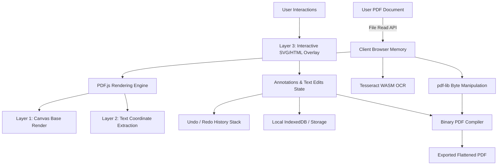

<div align="center">

# 📄 SASU PDF — Browser-Native PDF Studio & AI Suite

**A high-performance, 100% client-side PDF editing studio with in-place text modification, OCR, digital signatures, vector annotations, and document manipulation tools.**

[](https://nextjs.org/)
[](https://react.dev/)
[](https://www.typescriptlang.org/)
[](https://tailwindcss.com/)
[](https://github.com/RavirajSarangan/Pdf-Sasu-ai)
[](LICENSE)

[Live Studio](/editor) • [Tool Suite](/tools) • [Architecture](#-architecture--privacy-first-design) • [Quick Start](#-quick-start)

</div>

---

## 🌟 Key Highlights

- 🔒 **100% Zero-Server Privacy**: All PDF operations (rendering, editing, parsing, vector annotations, OCR) run entirely inside WebAssembly and client-side browser memory. Your documents **never** leave your machine.
- ✏️ **True In-Place Text Editing**: Detects existing PostScript fonts (Times New Roman, Helvetica, Courier), font weights, sizes, and bounding boxes for pixel-perfect inline PDF text modification.
- ✍️ **Digital Signature Studio**: Draw smooth vector signatures, type signatures with stylized calligraphy fonts, or upload signature image assets.
- 🔍 **Client-Side OCR Suite**: Extract readable text from scanned PDFs and document images directly in the browser via Tesseract.js WASM.
- ⚡ **Zero-Lag Interactive Canvas**: Multi-layered hardware-accelerated canvas architecture with pan, zoom, smooth bezier pen strokes, and real-time undo/redo history.
- 🛠️ **Complete 10-Tool Pipeline Suite**: Merge, Split, Compress, Watermark, Add Page Numbers, QR/Barcode generator, PDF to Image, and Image to PDF converter.

---

## 🛠️ Feature Modules

### 1. 🎨 Visual Studio Editor (`/editor`)
| Feature | Capabilities |
| :--- | :--- |
| **In-Place Text Edit** | Click any native text block to edit text inline with matched font family, weight, size, and alignment. |
| **Vector Drawing & Pen** | Ultra-smooth freehand ink drawing with variable stroke widths, colors, and opacity controls. |
| **Highlighter & Markups** | Multi-color highlighter overlays, underlines, strikethroughs, and bounding redaction boxes. |
| **Shapes & Callouts** | Rectangles, circles, directional arrows, connector lines, and rich sticky notes. |
| **QR & Barcodes** | Generate 2D QR codes and 1D Code128 barcodes directly onto PDF pages. |
| **Watermark & Numbers** | Custom angled text watermarks, page numbering formatters, and header/footer stamps. |
| **Document Metadata** | View and edit PDF Title, Author, Subject, Keywords, Creation Date, and export structured JSON. |

### 2. 🧰 Standalone Tool Suite (`/tools`)
- **Merge PDF (`/tools/merge`)**: Combine multiple PDF files in any custom order with drag-and-drop reordering.
- **Split PDF (`/tools/split`)**: Extract single pages or custom ranges (`1-3, 5, 8-10`) into new documents.
- **Compress PDF (`/tools/compress`)**: Downscale raster images and clean unused objects locally without quality degradation.
- **Client-Side OCR (`/tools/ocr`)**: Multi-lingual optical character recognition with export to TXT, Searchable PDF, or JSON.
- **Watermark PDF (`/tools/watermark`)**: Apply confidential stamps with rotation, custom opacity, and font styling.
- **Page Numbers (`/tools/page-numbers`)**: Add numbering (`Page X of Y`, `X / Y`) to headers, footers, margins.
- **QR & Barcode Studio (`/tools/barcode`)**: Standalone generator for QR codes, UPC, EAN, Code128 with PNG/PDF download.
- **PDF to Images (`/tools/pdf-to-image`)**: Convert every PDF page into high-resolution PNG or JPG image archives.
- **Images to PDF (`/tools/images-to-pdf`)**: Batch convert JPG, PNG, WebP images into a formatted PDF document.

---

## 🏗️ Architecture & Privacy-First Design



### 🔒 Privacy Guarantee
Unlike traditional cloud PDF converters, **SASU PDF** does not upload documents to any remote server or third-party endpoint. Rendering and modifications are handled client-side using WebAssembly and Web Workers.

---

## 💻 Tech Stack

- **Framework**: [Next.js 16 (App Router + Turbopack)](https://nextjs.org/)
- **UI & Components**: [React 19](https://react.dev/), [Tailwind CSS 4](https://tailwindcss.com/), [Lucide Icons](https://lucide.dev/)
- **PDF Engine**: [PDF.js (`pdfjs-dist`)](https://mozilla.github.io/pdf.js/) for rendering & text extraction
- **PDF Manipulation**: [pdf-lib](https://pdf-lib.js.org/) for programmatic binary assembly & compilation
- **OCR Engine**: [Tesseract.js](https://tesseract.projectnaptha.com/) for WASM optical character recognition
- **Barcode & QR**: `qrcode`, `jsbarcode`
- **State & Storage**: Client-side React Hooks, IndexedDB / LocalStorage workspace sync

---

## 🚀 Quick Start

### Prerequisites
- [Node.js](https://nodejs.org/) (version 18.17 or higher recommended)
- `npm`, `yarn`, `pnpm`, or `bun`

### 1. Clone the repository
```bash
git clone https://github.com/RavirajSarangan/Pdf-Sasu-ai.git
cd Pdf-Sasu-ai
```

### 2. Install dependencies
```bash
npm install
```

### 3. Run development server
```bash
npm run dev
```

Open [http://localhost:3000](http://localhost:3000) with your browser to experience the application.

### 4. Production Build
```bash
npm run build
npm run start
```

---

## 📂 Project Structure

```text
├── app/                      # Next.js App Router pages & API routes
│   ├── editor/               # Fullscreen Visual Studio Editor
│   ├── dashboard/            # Local Workspace & Document Library
│   ├── tools/                # Dedicated Standalone Tools Suite
│   ├── layout.tsx            # Root Layout with Toast & Providers
│   └── globals.css           # Global Tailwind CSS Styles
├── components/
│   ├── layout/               # Navbar, Footer
│   ├── pdf-editor/           # Canvas, Sidebars, Modals, Toolbars
│   ├── tools/                # Standalone tool components
│   └── ui/                   # Reusable Buttons, Inputs, Modals, Toasts
├── lib/
│   ├── pdf/                  # PDF.js renderers, text extractors, pdf-lib compiler
│   ├── storage/              # IndexedDB document store
│   └── utils.ts              # Utility helpers & coordinate converters
├── types/                    # TypeScript interfaces & Annotation schemas
└── public/                   # Static assets, PDF.js Web Worker
```

---

## 📄 License

Distributed under the **MIT License**. See `LICENSE` for more information.

---

<div align="center">

Crafted with modern web technologies by **[Sarangan Raviraj](https://github.com/RavirajSarangan)**

⭐ Star this repository if you find it helpful!

</div>
